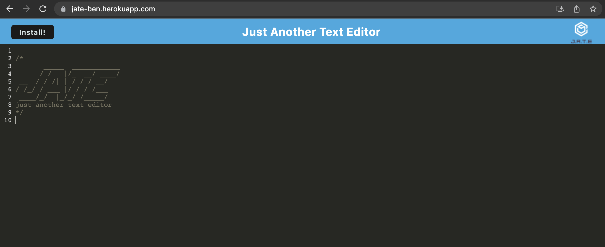

# JATE

## Description

This project is creating an online text editor, it is just another text editor (JATE)

## Table of Contents

- [Installation](#installation)
- [Usage](#usage)
- [Credits](#credits)
- [License](#license)
- [Tests](#tests)

## Installation

N/A

## Usage

1. Go to URL https://jate-ben.herokuapp.com/
   

2. The online editor will auto save any content.

3. And it still work even your are in offline mode.

4. Last but not least, the editor can be installed locally.

## Credits

BenLiu104 : https://github.com/BenLiu104

## License

License - MIT

## Tests

N/A
